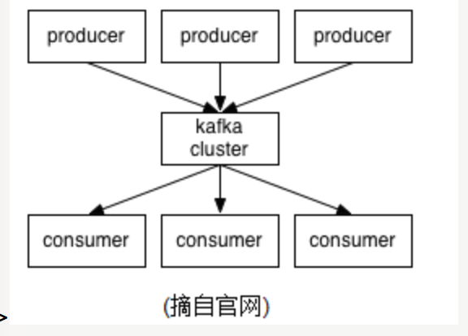

## kafka

 Kafka is a distributed,partitioned,replicated commit logservice。
 它提供了类似于JMS的特性，但是在设计实现上完全不同，此外它并不是JMS规范的实现。
 kafka对消息保存时根据Topic进行归类，发送消息者成为Producer,消息接受者成为Consumer,此外kafka集群有多个kafka实例组成，每个实例(server)成为broker。
 无论是kafka集群，还是producer和consumer都依赖于zookeeper来保证系统可用性集群保存一些meta信息。

 

 参考:http://www.cnblogs.com/likehua/p/3999538.html

### broker

 broker代表kafka集群中的一个实例,kafka的集群就是所有的broker实例.在集群中,会选取其中一个broker作为leader

### producer

 消息生产者

### consumer

 消息消费者

 消费者消费消息的信息可以保存在zookeeper或者kafka集群中,默认是在zookeeper中,主要时记录消费消息的offset,即最后一次消费的位置.可以设置消费者提提交offset的时间间隔和每次抓取消息的大小

### topic

### partitions

partition存在的意义是:

*. 分区存储:可以把消息进行分区存储,在分布式存取文件中,可以把消息分发到不同的机器和文件中
*. 负载均衡:producer可以把topic的消息按照指定的策略在多个partition上分发
*. 客户端快速读取:由于partition按照分区存储,consumer可以
每个topic可以指定有多个partition

###

get /brokers/topics/test-topic/partitions/1/state 查看partition的信息,比如leader和isr

